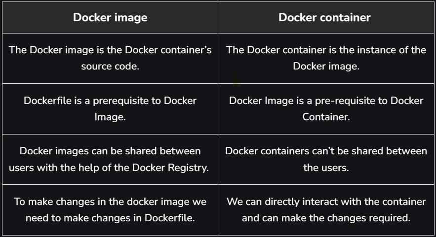

# Docker

- List Docker CLI commands:
    - `docker`
    - `docker container --help`

- Display Docker version and info:
    - `docker --version`
    - `docker version`
    - `docker info`

### Docker Images:

- Flow:  
    
- Docker images are built using the Dockerfile which consists of a set of instructions that are required to containerize an application
- Docker image is a lightweight, standalone, and executable software package that includes everything needed to run an application.
- This includes the application code, libraries, dependencies, tools, and a runtime
- A base operating system.
- It is a blueprint of the Container.

#### Commands of Docker Image:

- `docker image` - help

- Listing Docker Images:
    - `docker image ls` or `docker images` - Show all images
    - `docker image ls -a` - Show all images, including intermediate images (dangling images).
    - `docker image ls -q` - Show only the image IDs.

- Pulling a Docker Image:
    - `docker pull <image_name>:<tag>`
    - `docker pull ubuntu:latest` - Downloads an image from a Docker registry (Docker Hub).

- Building a Docker Image:
    - `docker build -t <image_name>:<tag> <path>` - Builds a new Docker image from a Dockerfile.
    - `docker build -t rajatapp:v1 .` - Dot (.) means dockerfile is located in current directory.

- Tagging a Docker Image:
    - `docker tag <image_id> <new_repo>:<new_tag>` : - Assigns a new name or tag to an image.
    - `docker tag abc123 myrepo/myapp:v1`

- Inspecting a Docker Image:
    - `docker inspect <image_id>` - Displays detailed information about an image.
    - `docker inspect ubuntu:latest`

- Removing a Docker Image:
    - `docker rmi <image_id>` or `docker image rm <image_id>` - Deletes an image from the local system.
    - `docker rmi -f abc123` - Force removal of an image using `-f`.

- Pushing a Docker Image:
    - `docker push <repo-name>:<tag>` - Uploads an image to a Docker registry.
    - `docker push myrepo/myapp:v1`

### Docker Containers:

- Docker container is a lightweight, standalone, and portable runtime environment that encapsulates an application along with its dependencies.
- Containers are created from Docker images.
- It is an instance of the Image.

#### Commands of Docker Containers:

- Listing Containers:
    - `docker ps` or `docker container ls` - Lists all running containers.
    - `docker ps -a` - Show all containers (both running and stopped).
    - `docker ps -q` - Show only container IDs.

- Running a New Container:
    - `docker run <options> <image-name>` - Creates and starts a new container from an image.
    - `docker run -it ubuntu bash` - Start an interactive session using `-it`.
    - `docker run -d <image-name>` - Starts a container in detached mode (background) using `-d`
    - `docker run -d -p 8080:80 nginx` - Map container ports to host ports using `-d`.
    - `docker run --name mycontainer nginx` - Assign a name to the container using `--name`


- Starting, Stopping, Inspecting a Containers:
    - `docker container start` is same as `docker start`
    - `docker container start <container_id/name>` - Start a Stopped Container.
    - `docker container stop <container-id/name>` - Stop a Running Container.
    - `docker container restart <container_id/name>` - Restart a Container.
    - `docker container exec -it <container_id> bash` - Run a container with it's ID.
    - `docker container inspect <container-id or name>` - Displays detailed information about a container.
    - `docker container stop $(docker ps -q)` - Stops all running containers.
    - `docker container attach <container-id>` -  Attaches to a running container’s terminal.
    - Legacy (without `container` keyword) vs Modern Syntax (with `container` keyword):

- Removing Containers:
    - `docker container rm <container-id or name>` - Remove a Specific Container.
    - `docker container prune` - Remove All Stopped Containers.
    - `docker container rm $(docker ps -aq)` - Removes all containers, including stopped ones.
    - `docker container kill <id>` - Kills a container (forcefully stops it).

- Copying Files Between Host and Container:
    - `docker cp <host-path> <container-id>:<container-path>` - Copy From Host to Container.
    - `docker cp <container-id>:<container-path> <host-path>` - Copy From Container to Host.

- Create copy of a container:
    ```docker
    docker commit <container_id/name> <new_image_name>:<tag>    # Commit the Current State of the Container to a New Image
    docker run -it <new_image_name> bash    # Run a New Container from the New Image
    docker container ls -a  # Show all containers (first exit from docker container)
    ```


### Docker Image vs Docker Container:

