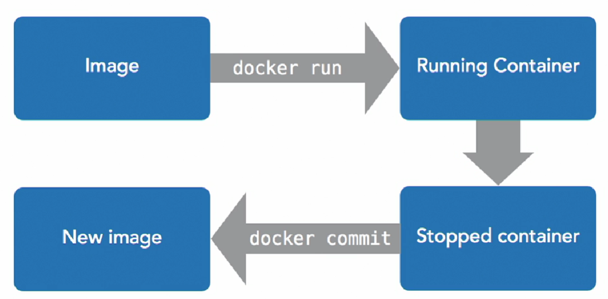
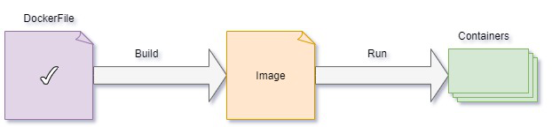
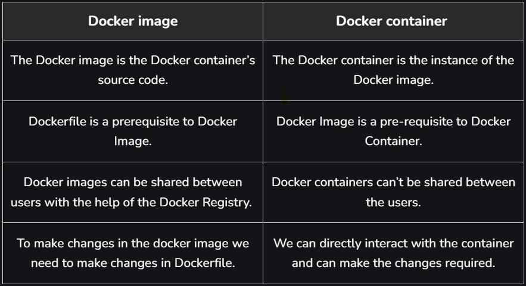

# Docker

- List Docker CLI commands:
    - `docker`
    - `docker container --help`

- Display Docker version and info:
    - `docker --version`
    - `docker version`
    - `docker info`


Docker is a platform for developers and sysadmins to develop, deploy, and run applications with containers.


## Table of Contents

- [Docker](#docker)
- [Why Docker?](#why-docker)
- [Images](#images)
    - [Commands of Docker Image](#commands-of-docker-image)
- [Containers](#containers)
    - [Commands of Docker Containers](#commands-of-docker-containers)
    - [Docker Image vs Docker Container](#docker-image-vs-docker-container)
- [Building and Running a Dockerfile](#building-and-running-a-dockerfile)
- [Docker Compose](#docker-compose)
- [Linux Container vs Windows Container](#linux-container-vs-windows-container)
- [Exposing Ports](#exposing-ports)
- [Docker Networks](#docker-networks)
- [Volumes](#volumes)
- [Sharing Data with the Host](#sharing-data-with-the-host)
- [Sharing Data Between Containers](#sharing-data-between-containers)
- [Miscellaneous](#miscellaneous)
    - [Docker Registries](#docker-registries)
- [References](#references)


### Why Docker?
- The use of Linux containers to deploy applications is called containerization. Containers are not new, but their use for easily deploying applications is. Containerization is increasingly popular because containers are:
- Flexible: Even the most complex applications can be containerized :-
- Lightweight: Containers leverage and share the host kernel.
- Interchangeable: You can deploy updates and upgrades on-the-fly.
- Portable: You can build locally, deploy to the cloud, and run anywhere.
- Scalable: You can increase and automatically distribute container replicas.
- Stackable: You can stack services vertically and on-the-fly.

The process can be summarized as follows :- 
1. Set up your Docker environment
2. Build an image and run it as one container
3. Scale your app to run multiple containers
4. Distribute your app across a cluster
5. Stack services by adding a back-end database
6. Deploy your app to production

The Docker Flow:  



## Images

- Docker images are built using the Dockerfile which consists of a set of instructions that are required to containerize an application
- Docker image is a lightweight, standalone, and executable software package that includes everything needed to run an application.
- This includes the application code, libraries, dependencies, tools, and a runtime
- A base operating system.
- It is a blueprint of the Container.
- Flow:  
    

### Commands of Docker Image:

- `docker image` - help

- Listing Images:
    - `docker image ls` or `docker images` - Show all images
    - `docker image ls -a` - Show all images, including intermediate images (dangling images).
    - `docker image ls -q` - Show only the image IDs.

- Pulling a Image:
    - `docker pull <image_name>:<tag>`
    - `docker pull ubuntu:latest` - Downloads an image from a Docker registry (Docker Hub).

- Building a Image:
    - `docker build -t <image_name>:<tag> <path>` - Builds a new Docker image from a Dockerfile.
    - `docker build -t rajatapp:v1 .` - Dot (.) means dockerfile is located in current directory.
    - `docker build -t image_name -f mycustom.dockerfile .` - If we want to provide different dockerfile name, use `-f`
    - `docker run -it -v /D:/mnt/d -p 85:85 -p 82:82 image_name bash` - Using `-v` we can provide host machine volume access to containers, using `-p` we can expose ports.

- Tagging a Image:
    - `docker tag <image_id> <new_repo>:<new_tag>` : - Assigns a new name or tag to an image.
    - `docker tag abc123 myrepo/myapp:v1`

- Inspecting a Image:
    - `docker inspect <image_id>` - Displays detailed information about an image.
    - `docker inspect ubuntu:latest`

- Cleaning up Images:
    - `docker rmi <image_id>` or `docker image rm <image_id>` - Deletes an image from the local system.
    - `docker rmi -f abc123` - Force removal of an image using `-f`.
    - `docker image prune` – Remove dangling (unused) images
    - `docker image rm $(docker image ls -q)` – Remove all images (use with caution)

- Pushing a Docker Image:
    - `docker push <repo-name>:<tag>` - Uploads an image to a Docker registry.
    - `docker push myrepo/myapp:v1`

- Saving & Loading Images
    - `docker save -o <file>.tar <image>:<tag>` – Save an image to a tar archive
    - `docker load -i <file>.tar` – Load an image from a tar archive

- Finding Images
    - Use the Docker CLI to search for images:  
      `docker search <term>`
      - Example: `docker search ubuntu`
    - We can also search and browse images on [Docker Hub](https://hub.docker.com/).

- Name Structure of Images
    - Images are named using the format:  
      `registry.example.com:port/organization/image-name:version-tag`
    - For most public images, `organization/image-name` is enough (e.g., `ubuntu`, `nginx`, `myorg/myapp:1.0`).
    - The registry and port are only needed for private or custom registries.


## Containers

- It is an instance of the Image.
- Containers are created from Docker images.
- `docker run hello-world` - Run a Container
- `docker run hello-world` - does exactly what it sounds like. It runs an image named "hello-world."
- `docker ps -a` - lists the containers on our system
- Let’s run this image again with `docker run hello-world`. The output is almost the same.
- Now run `docker ps -a` again - We see two stopped instances of hello-world, with two different names. Docker created an additional container. It didn’t reuse the first. When we told Docker to run an image named hello-world, it did exactly that; it ran a new instance of the image. If we want to reuse a container, we refer to it by name or id.
- With a single Docker command, `docker run -it ubuntu bash`, we downloaded an Ubuntu Linux image and started a login shell as root inside it. The `-it` flags allow us to interact with the shell.

### Commands of Docker Containers:

- Listing Containers:
    - `docker ps` or `docker container ls` - Lists all running containers.
    - `docker ps -a` - Show all containers (both running and stopped).
    - `docker ps -q` - Show only container IDs.

- Running a New Container:
    - `docker run <options> <image-name>` or `docker container run <image_id>` - Creates and starts a new container from an image.
    - `docker run -it ubuntu bash` - Start an interactive session using `-it`.
    - `docker run -d <image-name>` - Starts a container in detached mode (background) using `-d`
    -  `docker container run -p <host_port>:<container_port> <image_id>` – Map container ports to host machine
    - `docker run -d -p 8080:80 nginx` - Map container ports to host ports using `-d`.
    - `docker run --name mycontainer nginx` - Assign a name to the container using `--name`


- Starting, Stopping, Inspecting a Containers:
    - `docker container start` is same as `docker start`
    - `docker container start <container_id/name>` - Start a Stopped Container.
    - `docker container stop <container-id/name>` - Stop a Running Container.
    - `docker container restart <container_id/name>` - Restart a Container.
    - `docker container exec -it <container_id> bash` - Run a container with it's ID.
    - `docker container inspect <container-id or name>` - Displays detailed information about a container.
    - `docker container stop $(docker ps -q)` - Stops all running containers.
    - `docker container attach <container-id>` -  Attaches to a running container’s terminal.
    - Legacy (without `container` keyword) vs Modern Syntax (with `container` keyword):

- Removing Containers:
    - `docker container rm <container-id or name>` - Remove a Specific Container.
    - `docker container prune` - Remove All Stopped Containers.
    - `docker container rm $(docker ps -aq)` - Removes all containers, including stopped ones.
    - `docker container kill <id>` - Kills a container (forcefully stops it).

- Copying Files Between Host and Container:
    - `docker cp <host-path> <container-id>:<container-path>` - Copy From Host to Container.
    - `docker cp <container-id>:<container-path> <host-path>` - Copy From Container to Host.

- Create copy of a container:
    ```docker
    docker commit <container_id/name> <new_image_name>:<tag>    # Commit the Current State of the Container to a New Image
    docker run -it <new_image_name> bash    # Run a New Container from the New Image
    docker container ls -a  # Show all containers (first exit from docker container)
    ```

- Logging & Monitoring:
    - `docker container logs <container_id>` – View container logs
    - `docker container top <container_id>` – Show running processes inside a container
    - `docker container stats` – Display real-time resource usage of all containers

- Create WSl distribution from docker containers:
    - `docker export -o D:/wsl/filename.tar <container_id>` - Export the container
    - `wsl --import <DistroName> D:/WSL/ D:/wsl/filename.tar` - Import it as a new WSL distribution

### Docker Image vs Docker Container:




## Building and Running a Dockerfile :-

- A Dockerfile is a text file that contains instructions for building a Docker image.
- Each instruction in a Dockerfile creates a new layer in the image.
- The most common instructions are `FROM`, `RUN`, `COPY`, `ADD`, `CMD`, `EXPOSE`, `WORKDIR`, `ENV`, `ENTRYPOINT`, `VOLUME`, and `USER`.
- You can customize your image by installing packages, copying files, and setting environment variables.
- Dockerfiles look like shell scripts, but are not shell scripts. Each line creates a new image layer; previous layers are unchanged.

### Steps to Build and Run

1. **Write a Dockerfile**  
   - (Should be in `sudo su -`, root directory if on Linux)  
   - Create a file named `Dockerfile` in your project directory:  
     `nano Dockerfile` (Write your Dockerfile code)

2. **Build the Image**  
   - Use the command:  
     `docker build -t <image_name>:<tag> <path_to_dockerfile_directory>`  
     Example:  
     `docker build -t myapp:latest .`  
   - Or, for a simple tag:  
     `docker build -t filename ./`

   - We passed two arguments to build:
     - `-t filename` gave Docker a tag for the image. Since we only supplied a name, Docker tagged this build as `latest` in the last line of the build output.
     - The final argument, dot (or `.`), told Docker to look for the Dockerfile in the current working directory.

3. **List Images**  
   - Check your built image with:  
     `docker images`

4. **Run a Container from the Image**  
   - Use the command:  
     `docker run <image_name>:<tag>`  
     Example:  
     `docker run myapp:latest`  
   - Or, to automatically remove the container after it exits and run interactively:  
     `docker run --rm -it filename`

5. **Run with Port Mapping (if needed)**  
   - If your app exposes a port, map it to your host:  
     `docker run -p <host_port>:<container_port> <image_name>:<tag>`  
     Example:  
     `docker run -p 8080:80 myapp:latest`

6. **Run with Interactive Shell (for debugging)**  
   - Use:  
     `docker run -it <image_name>:<tag> /bin/bash`

### Useful Tips

- Use `.dockerignore` to exclude files/folders from the build context.
- Use `docker build --no-cache ...` to build without using cache.
- Use `docker logs <container_id>` to view output from your running container.
- Place the parts of your code that change most frequently at the end of your Dockerfile. This way, Docker can cache the earlier layers, and only the last layers will be rebuilt when you make changes, making builds faster.

### Sample Dockerfile
```Dockerfile
FROM ubuntu
# You can start with any base Docker image that works for you

# Update package list and install git
RUN apt update && apt-get install -y git

# Set the working directory
WORKDIR /root/bacnet-stack-0.8.6/

# Print the current working directory (for debug)
RUN pwd

# Copy the bin directory from your context to the image
COPY ./bin/ ./

# Expose the BACnet default port
EXPOSE 47808

# Set environment variable for PATH
ENV PATH="/root/bacnet-stack-0.8.6/bin:${PATH}"

# Example commands to run (only the last CMD will take effect)
# You can choose the one you need or use ENTRYPOINT for more control
# CMD ["./bacwi", "-1"]
# CMD ["./bacrp", "1234", "1", "1", "85"]
CMD ["./bacwp", "1234", "1", "1", "85", "16", "-1", "4", "10"]
```

### Resource Restriction

- **Memory limits:**  
  `docker run --memory <max-memory> <image-name> <command>`
- **CPU limits:**  
  `docker run --cpu-shares <value> <image-name>` (relative to other containers)  
  `docker run --cpu-quota <value> <image-name>` (absolute limit)

### Legacy Linking

- Links all ports, but only one way.
- Secret environment variables are shared only one way.
- Depends on startup order.
- Restarts sometimes break the links.

Example:
- Set environment variable:  
  `docker run --rm -e SECRET=theinternetlovescats -it --name catserver ubuntu:14.04 bash`
- Link containers:  
  `docker run --rm -it --link catserver --name dogserver ubuntu:14.04 bash`
- Test connectivity:  
  - On catserver: `nc -lp 1234`
  - On dogserver: `nc catserver 1234`
- Linking is one-way: linking dogserver to catserver does not link catserver to dogserver.

Check environment variables with `env`.


### More Dockerfile Instructions

- **MAINTAINER**:  
  `MAINTAINER Firstname Lastname <email@example.com>`
- **RUN**:  
  Runs a command and saves the result.  
  Example: `RUN unzip install.zip /opt/install/`
- **ADD**:  
  Adds local files or remote URLs.  
  Example: `ADD project.tar.gz /install/`
- **ENV**:  
  Sets environment variables.  
  Example: `ENV DB_PORT=1234`
- **ENTRYPOINT** and **CMD**:  
  - `ENTRYPOINT` specifies the start of the command to run.
  - `CMD` specifies the whole command to run.
  - Shell form: `CMD echo hello`
  - Exec form: `CMD ["/bin/echo", "hello"]`
- **EXPOSE**:  
  Maps a port into the container.  
  Example: `EXPOSE 8080`
- **VOLUME**:  
  Defines shared or ephemeral volumes.  
  Example: `VOLUME ["/host/path/", "/container/path/"]`
- **WORKDIR**:  
  Sets the working directory.  
  Example: `WORKDIR /install/`
- **USER**:  
  Sets which user the container will run as.  
  Example: `USER rajat` or `USER 1000`

```Dockerfile
FROM ubuntu:16.04 as builder    (# assign image name as builder, so we can use it later)
RUN apt-get update
RUN apt-get -y install curl
RUN curl https://google.com | wc -c > google-size

FROM alpine
COPY --from=builder /google-size /google-size    (# copy data from one image to another, it saves space because, ubuntu image is big as compared to alpine. Alpine is small base image)
ENTRYPOINT echo google is this big; cat google-size
```


## Docker Compose

- Docker Compose helps define and share multi-container applications using a YAML file.
- Commands:
  - `docker compose version` – Check Compose version
  - `docker compose up -d` – Start services in background
  - `docker compose down` – Stop and remove containers and network
  - `docker compose down --volumes` – Also remove named volumes


## Linux Container vs Windows Container :

- Linux containers and Windows containers differ in terms of the operating system that they run on.
- Linux containers run on a host operating system that is based on the Linux kernel, whereas Windows containers run on a host operating system that is based on the Windows kernel.
- As a result, Windows containers can only run Windows-based applications, while Linux containers can run a wider range of applications, including those built for Linux and Windows.
- Additionally, the management tools and ecosystem surrounding Linux containers are typically more mature and robust compared to those for Windows containers.

### Key Differences

- **Kernel Dependency:**  
  - Linux containers use Linux kernel features (namespaces, cgroups) and require a Linux-based host.
  - Windows containers use Windows kernel features and require a Windows-based host.

- **Application Compatibility:**  
  - Linux containers can run most open-source and enterprise Linux applications.
  - Windows containers are limited to Windows applications and services.

- **Cross-Platform:**  
  - Linux containers can run on Windows using a Linux VM (e.g., Docker Desktop), but Windows containers cannot run on Linux hosts.
  - Linux containers are more portable across different environments.

- **Ecosystem & Tooling:**  
  - Linux container tooling (Docker, Kubernetes, etc.) is more mature and widely adopted.
  - Windows container support is improving but not as extensive as Linux.

- **Use Cases:**  
  - Use Linux containers for most cloud-native, microservices, and open-source workloads.
  - Use Windows containers for legacy .NET Framework or Windows-specific applications.


## Exposing Ports

- To make services inside your container accessible from your host, use the `-p` (publish) flag:
  - `docker run --rm -it -p 45678:45678 -p 45679:45679 --name echo-server ubuntu:14.04 bash`
    - This maps port 45678 and 45679 on your host to the same ports inside the container.
    - Format: `-p <host_port>:<container_port>` (outside port : inside port).

- If you only specify the container port (e.g., `-p 45678`), Docker will randomly assign a host port:
  - `docker run --rm -it -p 45678 -p 45679 --name echo-server ubuntu:14.04 bash`

- To check which ports are mapped for a running container:
  - `docker port echo-server`  
    (where `echo-server` is the container name)

- To expose a UDP port, specify the protocol:
  - `docker run --rm -it -p 45678/udp --name echo-server ubuntu:14.04 bash`


## Docker Networks

- List existing Docker networks:
  - `docker network ls`
    - Example output:
      ```
      NETWORK ID     NAME      DRIVER    SCOPE
      c7376020aba9   bridge    bridge    local
      75919c8d5779   host      host      local
      53f3bd0aeab7   none      null      local
      ```
    - **bridge**: Default network for containers that don't specify another network.
    - **host**: Removes network isolation between the container and the host (use with caution).
    - **none**: Disables networking for the container.

- Create a new Docker network:
  - `docker network create learning`

- Run a container attached to a specific network:
  - `docker run --rm -it --net learning --name catserver ubuntu:14.04 bash`

- Create another network:
  - `docker network create catsonly`

- Connect an existing container to another network:
  - `docker network connect catsonly catserver`


## Volumes

- Volumes are Docker-managed storage, similar to shared folders.
- They are used to persist and share data between containers, and between containers and the host.
- **Types of Volumes:**
  - **Persistent Volume:**  
    Data remains on the host even after the container is removed. Useful for databases and important files.
  - **Ephemeral Volume:**  
    Exists only while at least one container is using it. Data is deleted when no containers use it.
- Volumes are **not** part of images; they are managed separately.
- Volumes are local to the Docker host unless using remote volume plugins.


## Sharing Data with the Host

- You can share folders or files from the host into a container.
- The file or folder on the host must exist before starting the container, or Docker may create an empty directory.
- **Volume Mount (using `-v`):**
  - Example:  
    `docker run -it -v D:\tempdocker:/shared-folder ubuntu bash`  
    (Shares `D:\tempdocker` from Windows host to `/shared-folder` in the container)
- **Bind Mount (using `--mount`):**
  - Lets you specify exactly where on the host and container to mount.
  - Example:  
    `docker run -it --mount type=bind,src=/path/to/data,target=/usr/local/data ubuntu bash`
  - On Windows, use absolute paths or `$(pwd)` for current directory:  
    `docker run -it --mount type=bind,src="$(pwd)",target=/src ubuntu bash`
  - Bind mounts are managed by the user, not Docker.


## Sharing Data Between Containers

- **volumes-from:**  
  Allows one container to mount volumes from another container.
- Shared volumes exist as long as they are being used by at least one container.
- **Examples:**
  - Create a shared folder:  
    `docker run -it -v /shared-folder ubuntu bash`
  - Share that folder with another container:  
    `docker run -it --volumes-from <container-name> ubuntu bash`
- **Volume Mount (using `--mount`):**
  - Example:  
    `docker run -it --mount type=volume,src=my-volume,target=/usr/local/data ubuntu bash`
  - Docker chooses the host location for named volumes.


## Miscellaneous

**Problem** : Not able to access internet inside docker windows container.  
**Solution** : Resolve it by setting the DNS.  

  - If we are making the call during build time you can set it in your docker daemon. In Docker Desktop go to "Settings" > "Docker Engine" and add the following to the JSON config.
  - "dns": ["1.1.1.1"]
  - If we are experiencing the problem during run time we can add the dns argument : --dns 1.1.1.1
  - Reference: https://stackoverflow.com/questions/59766135/not-able-to-access-internet-inside-docker-windows-container

### Docker Registries

- Registries manage and distribute Docker images.
- Docker Hub (https://hub.docker.com/) is the default public registry, free to use.
- You can also run your own private registry if needed.


## References:

- https://docs.docker.com/get-started/
- https://www.linkedin.com/learning/learning-docker-2018
- https://www.tutorialspoint.com/docker/index.htm
